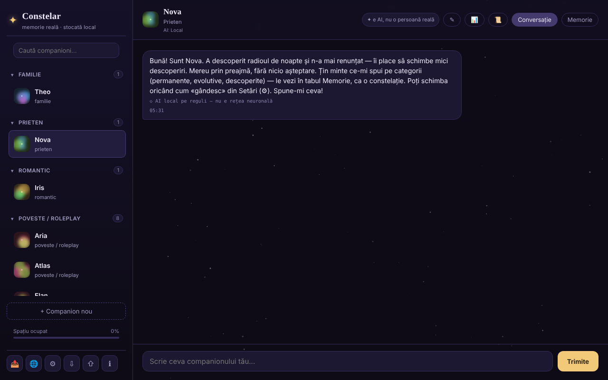

# Constelar

Companioni AI cu memorie reală, stocată local în browser, într-un singur fișier HTML.

**Live:** https://chiuta.github.io/Constelar/

## Ce este

Constelar este o aplicație (PWA opțională) în care creați unul sau mai mulți „companioni" AI (familie, prieten, romantic, poveste / roleplay), fiecare cu personalitate, context și o memorie proprie vizualizată ca o constelație. Datele rămân în browser; nimic nu pleacă de pe dispozitiv decât dacă alegeți un furnizor AI extern sau descărcați un model WebLLM. Aplicația este concepută pentru adulți și nu înlocuiește relațiile umane sau terapia (notă din aplicație).

## Funcții

- Companioni multipli: nume, tip de relație, trăsături, context / backstory, furnizor AI propriu sau cel global; buton de generare aleatoare a unui companion.
- Două file pentru fiecare companion: **Chat** și **Memory**. Memoria are trei categorii: *Permanent*, *Evolving*, *Discovered* (aceasta din urmă cu auto-extragere opțională), afișate ca stele pe care le puteți atinge pentru detalii.
- Furnizori AI în Setări: WebLLM (model rulat în tab prin WebGPU, descărcat o dată, variante 1B / 3B / 8B), Anthropic (Claude), compatibil OpenAI (presetări Groq, OpenRouter, Together, Mistral, DeepSeek, xAI, Ollama), Pollinations (fără cont), Gemini Nano nativ din Chrome și un motor local simplu bazat pe reguli (nu este o rețea neurală; etichetat ca atare în chat).
- „Test connection", reamintire „It's AI" la interval configurabil (minute; 0 = oprit), citire cu voce tare a răspunsurilor (speechSynthesis).
- Rezumat al conversației („Conversation recap", calculat local după frecvența cuvintelor) și export al unei conversații.
- Export / import al tuturor datelor (⇩ / ⇧).
- Resurse de criză accesibile din bara laterală și dialog de siguranță când sunt detectate anumite expresii.
- Meniu „Share" (link, WhatsApp, X, Facebook, LinkedIn, Fediverse).
- Interfață în 7 limbi: engleză, română, franceză, italiană, spaniolă, portugheză, germană.

## Manual de utilizare

1. Deschideți pagina și apăsați „+ New companion" (sau „+ Create your first companion").
2. Completați numele, tipul relației, trăsăturile și contextul; alegeți furnizorul AI („Same as Settings (global)" sau altul), apoi „Create".
3. În fila **Chat** scrieți mesajul și apăsați „Send" sau `Enter` (`Shift+Enter` pentru rând nou).
4. În fila **Memory** adăugați amintiri cu „+" în categoriile Permanent / Evolving / Discovered.
5. Pentru un AI real, deschideți ⚙ (AI Settings), alegeți „Provider", introduceți cheia API (și, dacă e cazul, „Base URL" / „Model"), folosiți „Test connection", apoi „Save". Pentru WebLLM apăsați „Download and start the model".
6. Schimbați limba din butonul 🌐 sau din selectorul „Language" din Setări.
7. Salvați datele cu ⇩ (export) și le restaurați cu ⇧ (import).
8. `Esc` închide ferestrele modale. ℹ deschide „About Constelar" și termenii/confidențialitatea.

## Confidențialitate și rețea

- **Stocare locală:** `localStorage`, cheia `constelar_state_v1` (companioni, memorii, conversații, setări; inclusiv cheia API dacă o introduceți). Aplicația testează disponibilitatea `localStorage` și avertizează dacă nu funcționează. Fără cookie-uri.
- **Hosturi contactate, doar la acțiunea dumneavoastră:**
  - furnizorul AI ales: `api.anthropic.com`, `api.openai.com` sau alt Base URL (inclusiv `openrouter.ai` în presetări), cu mesajele și cheia trimise direct din browser;
  - `text.pollinations.ai`, dacă alegeți Pollinations (aplicația cere acordul o singură dată);
  - `esm.run` (CDN), pentru încărcarea bibliotecii `@mlc-ai/web-llm@0.2.84`, și apoi descărcarea modelului ales, dacă folosiți WebLLM;
  - linkurile către `iasp.info` (resurse de criză) și butoanele „Share" se deschid doar la clic.
- Fără analitice. Cu furnizorul implicit „motor local simplu" sau cu modele deja descărcate, conversațiile nu părăsesc dispozitivul.
- Când este servit prin HTTPS, `sw.js` (opțional) se înregistrează și păstrează în cache „app shell"-ul; nu atinge `localStorage`.

## Rulare locală / offline

Descărcați `index.html` (opțional și `sw.js`, pentru instalare ca aplicație pe un server HTTPS) și deschideți-l în browser. Fără internet funcționează motorul local simplu și modelele WebLLM deja descărcate în cache; furnizorii externi și prima descărcare WebLLM necesită internet.

## Licență

Licența nu este încă declarată explicit în acest repository; vezi nota din aplicație. Aplicația afirmă: „Codul sursă al Constelar este © Alexandru-Ionuț Chiuță"; conținutul creat de utilizator rămâne al acestuia.

## Audit

Audit: 2026-10-10 — verificat cu Playwright și axe-core; randările de conținut (mesaje, memorii, rezumat) folosesc `escapeHtml` (testat cu payload ``); exportul de date golește cheia API. Corectat: bara de sus pe ecran îngust (fila „Memory" ieșea din ecran). Atenție: descrierea „100% locală" din GitHub nu e valabilă dacă alegeți un furnizor AI extern sau WebLLM (vezi mai sus).

## Autor

Alexio — Alexandru-Ionuț Chiuță. Contact: alexio@trom.tf

## English summary

Constelar is a single-file app for AI companions with local, visible memory (permanent / evolving / discovered). Data lives in localStorage (`constelar_state_v1`). AI providers: in-tab WebLLM, Anthropic, OpenAI-compatible, Pollinations, Chrome's Gemini Nano, or a simple rule-based local engine. External hosts are contacted only when you pick them (provider APIs, esm.run CDN for WebLLM, Pollinations). UI in 7 languages.
